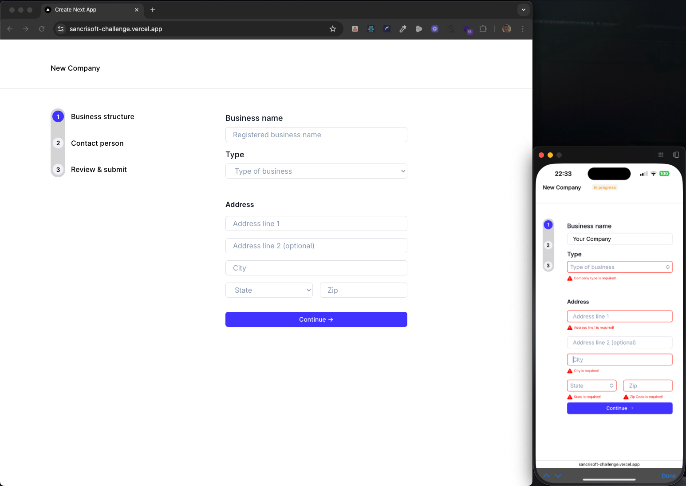

# Sancrisoft Multi-Step Form Challenge

A modern, well-structured multi-step form built with Next.js and TypeScript, featuring robust state management, modular components, and comprehensive unit testing.

---

## 🖼️ Responsive & Accessible UI Demo



_Desktop and mobile views demonstrating responsive layout, semantic HTML, ARIA attributes, and real-time validation feedback._

---

## 🚀 Project Structure & Strengths

```
sancrisoft/
│
├── src/
│ ├── app/                # Next.js entry point and layout
│ ├── components/         # Modular, reusable UI components
│ │ ├── steps/            # Step1, Step2, Step3: Multi-step form logic
│ │ ├── ui/               # Atomic UI elements (FormField, PhoneField, etc.)
│ │ └── styles/           # Styled-components for maintainable styles
│ ├── constants/          # Centralized constants for DRY code
│ ├── contexts/           # React Context for global form state management
│ ├── hooks/              # Custom hooks for clean, reusable logic
│ ├── types/              # TypeScript types for safety and maintainability
│ ├── utils/              # Utility functions (validation, API, storage, phone)
│ │ └── tests/            # Comprehensive unit tests for utilities
│ ├── styles/             # Global styles for consistent UI/UX
│ └── tests/              # Additional test setup and coverage
│
├── public/               # Static assets
├── package.json          # Project dependencies and scripts
├── jest.config.ts        # Jest configuration for testing
├── tsconfig.json         # TypeScript configuration
└── README.md             # Project documentation
```

---

## 🏆 Key Strengths

- **Unit Testing:**
  - Utilities and core logic are covered by robust Jest tests (`src/utils/__tests__`, `src/constants/__tests__`).
- **Modern Code Patterns:**
  - Uses React Context for global state, custom hooks for logic reuse, and atomic UI components for scalability.
- **TypeScript Safety:**
  - All business logic and components are strongly typed for reliability and maintainability.
- **Separation of Concerns:**
  - Clear separation between UI, logic, state, and constants for easy navigation and future scaling.
- **Styled Components:**
  - Consistent, maintainable styling using styled-components and global styles.
- **Form Validation:**
  - Centralized, testable validation logic for each step.
- **API Abstraction:**
  - API calls are abstracted for easy mocking and testing.
- **Responsiveness:**
  - The UI is fully responsive, ensuring a seamless experience across devices and screen sizes.
- **Semantic HTML:**
  - Uses semantic HTML elements for better structure, SEO, and maintainability.
- **Accessibility (a11y)**:
  - Implements ARIA attributes and accessible roles to support screen readers and improve usability for all users.

---

## 🛠️ Getting Started

### 1. **Clone the repository**

```bash
git clone https://github.com/thomaslnx/sancrisoft-challenge.git
cd sancrisoft
```

### 2. **Install dependencies**

```bash
npm install
```

### 3. **Run the development server**

```bash
npm run dev
```

> **OBS:** What is better than having to build the project by yourself, only then seeing the magic happening? Is it have it ready for action, right? Relax guys, I've got your backs. Here is a link has a live version: [Live Demo](https://sancrisoft-challenge.vercel.app/), fully functional. Go ahead and test it.

### 4. **Run tests**

```bash
npm run test
```

---

## 💡 Notes for Reviewers

- The project demonstrates best practices in React, TypeScript, and testing.
- The codebase is modular, readable, and ready for scaling or feature extension.
- All business logic is covered by unit tests, ensuring reliability.

---

**Thank you for reviewing!**  
Let me know if you need any more details or a demo walkthrough.
